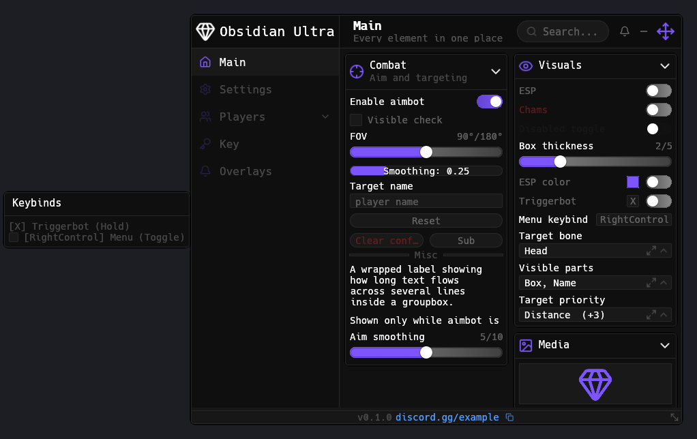
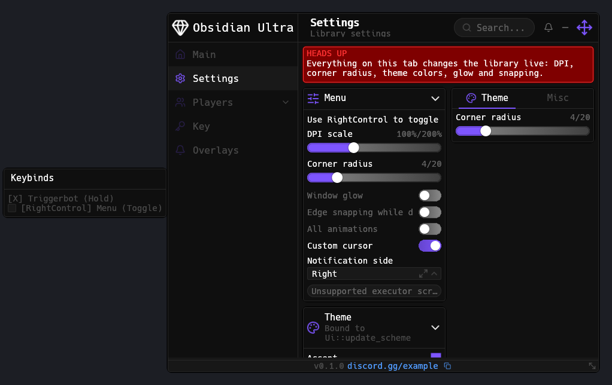
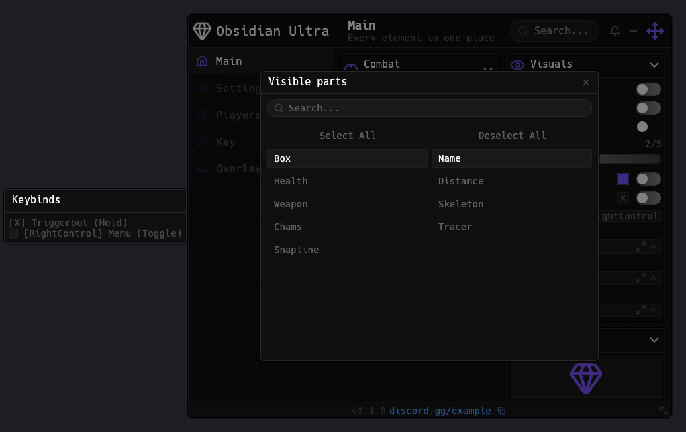
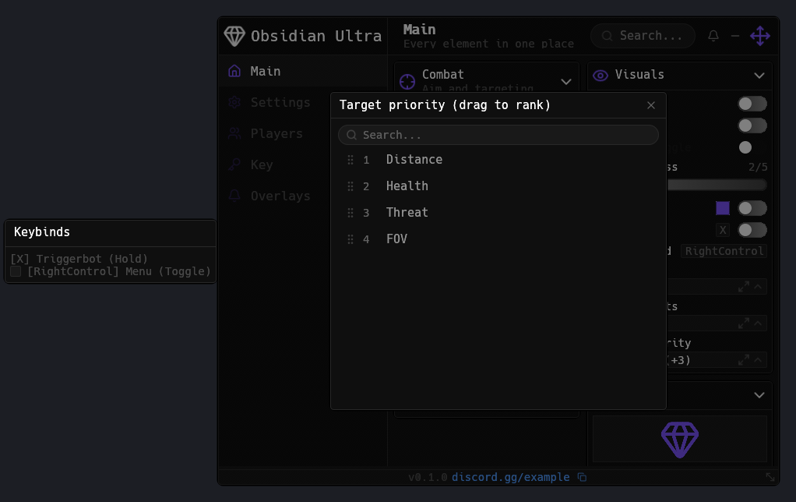
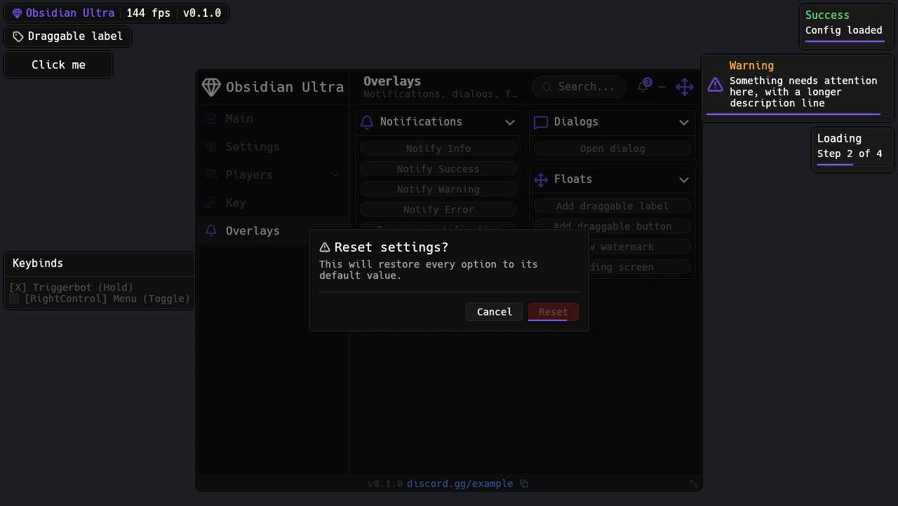
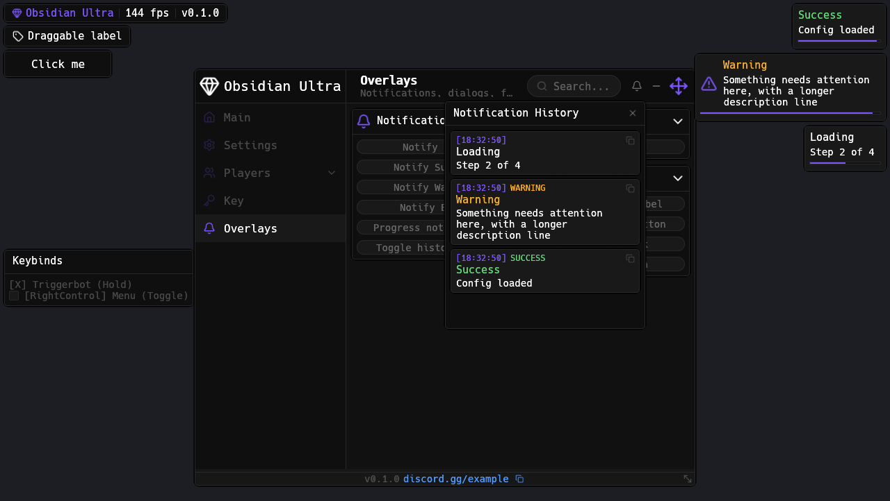
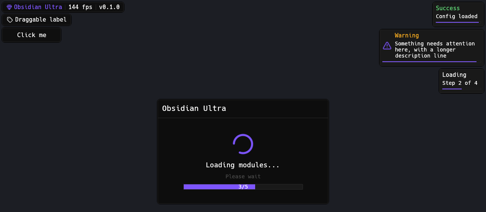

# Obsidian Ultra

A Rust port of the [Obsidian](https://github.com/deividcomsono/Obsidian) Roblox UI library: the same retained object model (window -> tabs -> groupboxes -> elements with handles, `set_value`, listeners and global `Toggles`/`Options` registries), the same look, drawn with [egui](https://github.com/emilk/egui)'s painter. Runs standalone (eframe) or inside any egui host, including DirectX overlay hooks.



| Settings tab (DPI, radius, theme) | Expanded dropdown |
|---|---|
|  |  |

| Priority dropdown | Dialog with wait-time button |
|---|---|
|  |  |

| Notifications, history panel, watermark, draggables | Loading screen |
|---|---|
|  |  |

<details>
<summary>150% DPI scale</summary>

__omp_shell("[dpi150](docs/dpi150.png)")
</details>

```
cargo run -p obsidian-showcase                       # interactive showcase
cargo run -p obsidian-showcase -- --dpi 150          # start at 150% DPI scale
cargo run -p obsidian-showcase -- --screenshot x.png # render, save a screenshot, exit
cargo test --workspace                               # unit + headless behavior tests
```

```
crates/obsidian-ultra-core   renderer-agnostic model, layout, painting (epaint shapes)
crates/obsidian-ultra-egui   egui backend: input, text fields, Lucide icons, textures
examples/showcase            eframe app exercising every element
```

## Quick start

```toml
[dependencies]
obsidian-ultra-core = "0.1"
obsidian-ultra-egui = "0.1"
egui = "0.36"
```

```rust
use obsidian_ultra_core::*;
use obsidian_ultra_egui::Obsidian;

let ui = Ui::new();
let window = ui.create_window(WindowInfo { title: "My Menu".into(), ..Default::default() });
let tab = window.add_tab(TabInfo::new("Main").icon("house"));
let combat = tab.add_groupbox(GroupboxInfo::left("Combat"));

let aimbot = combat.add_toggle("Aimbot", ToggleInfo::new("Enable aimbot").default_value(true));
aimbot.on_changed(|on| println!("aimbot: {on}"));
aimbot.add_key_picker("AimbotKey", KeyPickerInfo::key("Aimbot", Key::E).mode(KeyMode::Hold));

combat.add_slider("Fov", SliderInfo::new("FOV", 0.0, 180.0, 90.0).suffix("°"));
combat.add_dropdown("Bone", DropdownInfo::new("Target bone", ["Head", "Torso"]).default_value("Head"));

// Read values from anywhere (handles are Send + Sync):
let fov = ui.option("Fov").map(|o| o.value());

// Every egui frame:
let mut obsidian = Obsidian::new(ui.clone());
// obsidian.show(&ctx);
```

Open/close the menu with `RightControl` (`WindowInfo::toggle_keybind`) or `ui.toggle(None)`. The showcase's `OBSIDIAN_DEMO_*` environment variables open the states shown above. The showcase's `OBSIDIAN_DEMO_*` environment variables open the states shown above.

## Embedding in an existing egui host

`Obsidian::show(&ctx)` draws into the current egui frame; call it after your own panels. Text fields are hosted as egui `TextEdit`s so IME and clipboard work. The core reports the rects it owns so egui widgets underneath stop reacting while the menu covers them (`FrameOutput::interactive_rects`). For overlays, set `obsidian.screen = Some(game_viewport_rect)`.

On Windows the backend reads raw key state (`GetAsyncKeyState`) so left/right modifiers and keybinds work even when egui has no focus; replace it with `Obsidian::set_raw_keys`.

## Features

Window: draggable with edge snapping, resizable, corner radius, DPI scale, glow, background image, minimizable card with labels, sidebar resize + compact mode, search (fuzzy, global, values), footer segments with copy buttons, notification bell + history panel, custom cursor, keybind frame.

Tabs: icons, descriptions, sub-tabs (chip bar + nested sidebar list), tabboxes, groupboxes (collapsible, pop-out floats), warning box, profile banners, key tabs, dependency boxes.

Elements: divider, label (rich text), button (double-click confirm, sub-buttons), toggle (switch/checkbox), input (numeric, verify, finished), slider (compact, right-click entry), dropdown (single/multi, searchable, expandable grid, drag-select, value images), priority dropdown (drag to rank), image, profile card, custom draw, key picker (Always/Toggle/Hold/Press, modifiers, black/whitelists), color picker (HSV, alpha, hex/RGB, copy/paste, resizable).

Overlays: notifications (types, steps, persist), history, dialogs (variants, wait-time buttons), tooltips, draggable label/button/menu/image-button, watermark with getters, loading screen, unsupported-executor screen.

## Roblox -> Rust mapping

| Lua | Rust |
|---|---|
| `Library:CreateWindow(Info)` | `ui.create_window(WindowInfo)` |
| `Window:AddTab(...)` / `AddKeyTab` / `AddDialog` | `window.add_tab(TabInfo)` / `add_key_tab` / `add_dialog(idx, DialogInfo)` |
| `Tab:AddGroupbox` / `AddTabbox` / `AddSubTab` | `tab.add_groupbox(GroupboxInfo)` / `add_tabbox(TabboxInfo)` / `add_sub_tab(SubTabInfo)` |
| `Groupbox:AddToggle(idx, Info)` etc. | `groupbox.add_toggle(idx, ToggleInfo)` (all `Add*` via the `Container` trait) |
| `Toggle:AddKeyPicker` / `AddColorPicker` | `toggle.add_key_picker(idx, KeyPickerInfo)` / `add_color_picker(idx, ColorPickerInfo)` |
| `Toggles[idx]` / `Options[idx]` | `ui.toggle_by(idx)` / `ui.option(idx)` (`OptionHandle::value()`) |
| `Library:Notify(...)` | `ui.notify(NotifyInfo)` / `ui.notify_text(text, secs)` |
| `Library:SetDPIScale(150)` | `ui.set_dpi_scale(150.0)` |
| `Library.Scheme.AccentColor = ...` | `ui.update_scheme(|s| s.accent = ...)` |
| `Library:Unload()` | `ui.unload()` |

Dropped (no equivalent outside Roblox): Viewport, Video, Player/Team dropdown special types, mobile buttons, sounds.

## Notes

- Notification history timestamps are UTC.
- Icons are [Lucide](https://lucide.dev) (ISC, see `crates/obsidian-ultra-egui/assets/lucide/LICENSE`); use `IconRef::Bytes`/`IconRef::Path`/`IconRef::Texture` for your own images.
- Headless testing: `obsidian_ultra_core::testing::Harness` runs frames without a GPU.

## License

MIT
